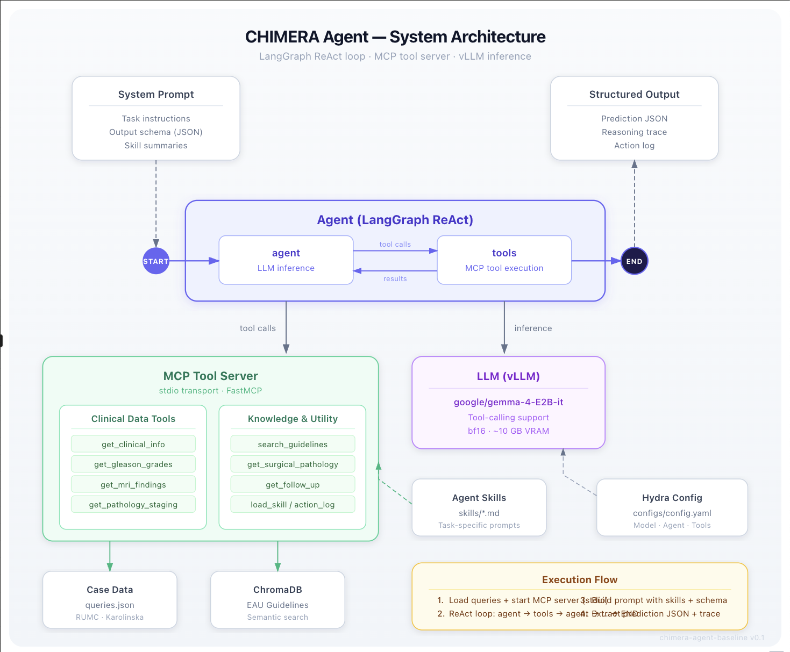

# Architecture

## Overview

The baseline agent has four main components:



The agent calls tools via MCP, reasons over the results, and produces a
prediction with a reasoning trace. The MCP server records every tool call
in an action log for evaluation.

## MCP Tool Server

All tools are exposed via the [Model Context Protocol](https://modelcontextprotocol.io).
The server runs as a subprocess (stdio transport) and is
framework-agnostic — any MCP client works, not just LangGraph.

**Source**: `src/chimera_agent_baseline/mcp_server.py`

### Built-in tools

| Tool | Purpose | Source data |
|------|---------|-------------|
| `get_clinical_info` | Patient demographics, PSA, history | `clinical-data.json` |
| `get_gleason_grades` | Gleason patterns + ISUP grade | `clinical-data.json` |
| `get_mri_findings` | PI-RADS, lesion detection, volume | `clinical-data.json` |
| `get_pathology_staging` | pT / N / M classification | `clinical-data.json` |
| `get_surgical_pathology` | Margins, capsular penetration, LVI | `clinical-data.json` |
| `get_follow_up` | BCR status, follow-up timeline | `clinical-data.json` |
| `search_guidelines` | Semantic search over EAU guidelines | `resources/guidelines_db/` |
| `load_skill` | Load Agent Skill instructions | `skills/*/SKILL.md` |
| `get_action_log` | Retrieve recorded tool calls (runner-only) | In-memory |

### Adding a custom tool

1. Define a `ToolSpec` in `src/chimera_agent_baseline/tools/definitions.py`:

```python
MY_TOOL = ToolSpec(
    name="get_my_data",
    description="Retrieve my custom data for a patient case.",
    field_mapping={
        "case_id": ["case_id"],
        "my_field": ["source_field_variant_a", "source_field_variant_b"],
    },
)
```

2. Add it to `TOOL_REGISTRY` at the bottom of the same file.

The field mapping handles different naming conventions across data sources
(RUMC vs. Karolinska). Source fields are tried in order — first match wins.

For tools that don't follow the precomputed-data pattern (e.g. an API call
or a computation), register them directly in `mcp_server.py` using the
`@mcp.tool()` decorator, similar to `search_guidelines`.

### Action log

Every tool call is automatically logged by the MCP server with `tool`,
`args`, `result`, and `timestamp`. After each case, the runner calls
`get_action_log` to retrieve the log. This is used for faithfulness
evaluation — verifying that the agent's reasoning trace references
evidence it actually retrieved.

Participants do not need to implement logging — it's built into the
MCP server. Any framework that talks to the MCP server gets its calls
logged.

## Agent Skills

Skills follow the [Agent Skills](https://agentskills.io) open standard.
Each skill is a directory with a `SKILL.md` file containing YAML
frontmatter (name + description) and markdown instructions.

**Location**: `skills/`

```
skills/
└── guideline-search/
    └── SKILL.md
```

At startup, only skill metadata (name + description) is injected into the
system prompt. The agent can call `load_skill("guideline-search")` to get
the full instructions on demand (progressive disclosure).

### Adding a skill

Create a new directory in `skills/` with a `SKILL.md`:

```markdown
---
name: my-skill
description: >
  What this skill does and when the agent should use it.
  Include keywords that help the agent recognize relevant scenarios.
---

## When to use

Describe the scenarios where this skill applies.

## Instructions

Step-by-step guidance for the agent.
```

The skill is picked up automatically — no code changes needed.

## Guidelines Search (RAG)

Clinical guidelines are chunked, embedded, and stored in ChromaDB for
semantic retrieval via the `search_guidelines` tool.

**Database**: `resources/guidelines_db/` (persisted ChromaDB)
**Embedding model**: `resources/embedding_model/` (google/embeddinggemma-300m)

The baseline database contains the
[EAU Prostate Cancer Guidelines (2026)](https://uroweb.org/guidelines/prostate-cancer).
It is pre-built and included in the repository.

### Rebuilding with different guidelines

1. Place your guideline PDF at a known path
2. Run:

```bash
python scripts/process_guidelines.py --pdf path/to/your/guidelines.pdf
```

This extracts text, chunks it (~1000 chars with 200 overlap), embeds with
embeddinggemma-300m, and persists to `resources/guidelines_db/`. The
embedding model is saved to `resources/embedding_model/` so the container
doesn't need network access at runtime.

Requires `HF_TOKEN` in `.env` for the embedding model download.

## Output Format

Each case produces:

```json
{
    "case_id": "rumc-001",
    "cspca_probability": 0.45,
    "biopsy_recommendation": true,
    "reasoning_trace": "PSA is 23.5 which is elevated. ISUP grade 5 indicates...",
    "action_log": [
        {"tool": "get_clinical_info", "args": {"case_id": "rumc-001"},
         "result": {"psa": 23.5, ...}, "timestamp": "..."},
        ...
    ]
}
```

| Field | Who produces it | Purpose |
|-------|----------------|---------|
| Prediction fields | The LLM | Scored numerically (AUROC, C-index) |
| `reasoning_trace` | The LLM | Qualitative evaluation of clinical reasoning |
| `action_log` | The MCP server | Faithfulness verification — ground truth of what was retrieved |

The `reasoning_trace` should reference specific values from the tools.
The `action_log` is used to verify those references are grounded in
actual evidence (not hallucinated).
